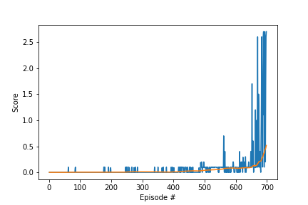

# Report
In this project, the method DDPG is implemented to control 20 robotic arms to follow a sphere.

## DDPG
The Deep Deterministic Policy Gradient (DDPG) algorithm was introduced in this paper: [Continuous Control With Deep Reinforcement Learning](https://arxiv.org/pdf/1509.02971.pdf)
The authors present the method as "a model-free, off-policy actor-critic algorithm using deep function approximators that can learn policies in high-dimensional, continuous action spaces".


The implementation of DDPG was initialized from the DDPG implementaiton in [Udacity Deep RL Github](https://github.com/udacity/deep-reinforcement-learning) **ddpg_pendulum**.
Small changes have been made to allow for multiple agents, such as expanding the replay buffer and looping over agents.

## Hyper parameters
```python
BUFFER_SIZE = int(1e5)  # replay buffer size
BATCH_SIZE = 128        # minibatch size
GAMMA = 0.99            # discount factor
TAU = 1e-3              # for soft update of target parameters
LR_ACTOR = 1e-3         # learning rate of the actor 
LR_CRITIC = 1e-4        # learning rate of the critic
WEIGHT_DECAY = 0.0      # L2 weight decay
theta = 0.15            # Ornstein-Uhlenbeck noise parameter mean
sigma = 0.1             # Ornstein-Uhlenbeck noise parameter std
```
## Architecture
The network is kept the same as the original architecture from ddpg_pendulum, except I have added batchnormalization to the first layer, as well as changed the number of neurons to 256 and 512 for the first two layers in both the actor and the critic architecture. 


## Result
The results from running this implementation is seen in the figure below. The environment was solved in 105 episodes.

The blue line shows the average score of the episode for all agents, while the orange line shows the average score for all agents over the last 100 episodes. The environment is considered solved when the average over the last 100 episodes is above 30, averaged over all agents.

## Possible future work
* Hyperparameter optimization. Only a few runs have been made to find the used hyperparameters. A more thorough search might optimize the performance. 
* Try the more reasent version of DDPG, namely the [D4PG](https://arxiv.org/pdf/1804.08617.pdf) algorithm. 
