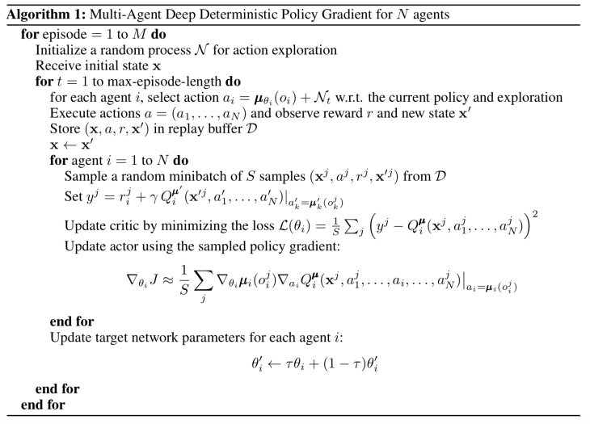
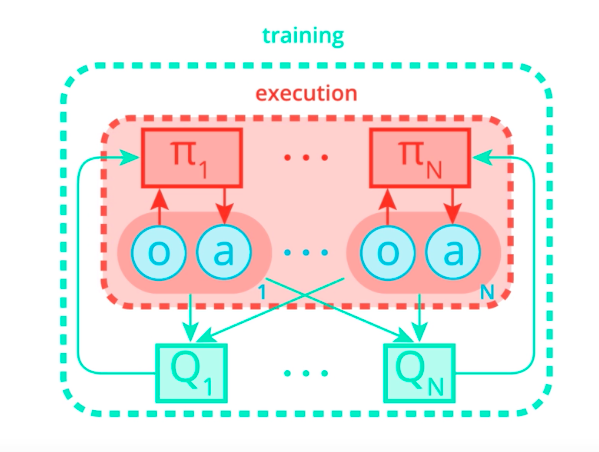

# Report
In this project, the method MADDPG is implemented to control 2 agents playing tennis.

## MADDPG
The Multi Agent Deep Deterministic Policy Gradient (MADDPG) algorithm was introduced in this paper: [Multi-Agent Actor-Critic for Mixed Cooperative-Competitive Environments](https://arxiv.org/pdf/1706.02275.pdf)
In this paper, a multi-agent version of DDPG is introduced.




In MADDPG, the Critic sees the combined state space of all agents, while each actor sees a local observation. 
As the two agents in this environment are very similar, and as their objective is the same (keep the ball in the air), and as they see similar (mirrored) state spaces, I have chosen to implement a shared Actor and Critic neural network to control both agents. This is the main alteration to MADDPG.

## Hyper parameters
```python
BUFFER_SIZE = int(1e6)  # replay buffer size
BATCH_SIZE = 128        # minibatch size
GAMMA = 0.99            # discount factor
target_mix = 3e-3       # for soft update of target parameters
LR_ACTOR = 1e-3         # learning rate of the actor 
LR_CRITIC = 1e-4        # learning rate of the critic
theta = 0.15            # Ornstein-Uhlenbeck noise parameter
mu = 0.0                # Ornstein-Uhlenbeck noise mean
sigma = 0.1             # Ornstein-Uhlenbeck noise std
```
## Architecture
The network architecture roughly consists of three dense layers with batchnormalization on the first layer.


## Result
The results from running this implementation is seen in the figure below. The environment was solved in XX episodes.

The blue line shows the max score of the episode obtained by both agents, while the orange line shows the average max score for both agents over the last 100 episodes. The environment is considered solved when the average over the last 100 episodes is above 0.5.

## Possible future work
* Hyperparameter optimization. Only a few runs have been made to find the used hyperparameters. A more thorough search might optimize the performance. 
* Try the more reasent version of DDPG, namely the [D4PG](https://arxiv.org/pdf/1804.08617.pdf) algorithm. 
